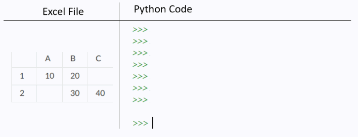

# pylightxl - A Light Weight Excel Reader/Writer
A light weight, zero dependency (only standard libs used), to the point (no bells and whistles) 
Microsoft Excel reader/writer(coming soon) python 2.7-3+ library. See documentation: [docs](https://pylightxl.readthedocs.io)

Sample - see [docs - quick start gudide](https://pylightxl.readthedocs.io/en/latest/quickstart.html) for more examples:


---

#### **Supports**:
 - Supports .xlsx and .xlsm file extensions. 

#### **Limitations**:
 - Does not support .xls (excel 97-2003 worksheet).
 - Does not support worksheet cell data more than 536,870,912 cells (32-bit list limitation)

#### **In-work version 1.4**
- new-feature: write new excel file from pylightxl.Database (done and tested)
- new-feature: write to existing excel file from pylightxl.Database (working on it)

#### **Why pylightxl over pandas/openpyxl**
- **(compatibility +1, small lib +1)** pylightxl has no external dependencies (only uses python built-in 
  standard libs)
- **(compatibility +1)** pylightxl was written to be compatible for python 2.7-3+ under one single
  pylightxl version. It does not impose rules on users to switch versions 
- **(small lib +1)** pylightxl was written to simply read/write, thereby making the library small 
  without any bells or whiles which makes it easy to compile with PyInstaller and other packagers
- **(user friendly +1)** pylightxl was written to be as pythonic and easy to use as possible. Core 
  developers actively survey Stack Overflow questions on working with excel files to tailor the API 
  for most common problems.
- **(see [xlrd](https://xlrd.readthedocs.io/en/latest/) before pylightxl)** Note that the xlrd library is 
  very similar in values to pylightxl, but with much more functionality! Please take a look 
  at [xlrd](https://xlrd.readthedocs.io/en/latest/) to see if it is a good fit for your project.
  So why pick pylightxl over xlrd that has much more to offer? Currently, xlrd does not have any active
  developers. Pylightxl is a new library aimed to help solve current excel data issues (as surveyed 
  by Stack Overflow), please submit your suggestions to help improve this library together

---

#### **Setup**
pylightxl is officially published on [pypi.org](pypi.org), however one of the
key features of pylightxl is that it is packed light in case the user has pip
and/or download restrictions, see [docs - installation](https://pylightxl.readthedocs.io/en/latest/installation.html)

```pip install pylightxl```

---

#### **Contact/Questions/Suggestions**
If you have any questions or feedback, we would love to hear from you - send us 
an realpydpiper@gmail.com or post directly on [GitHub](https://github.com/PydPiper/pylightxl).

We try to keep an active lookout for users trying to solve Microsoft Excel related problems with
python on Stack Overflow. Please help us build on the great community that python already is by
helping others get up to speed with pylightxl!

From everyone in the pylightxl family, thank you for visiting!

